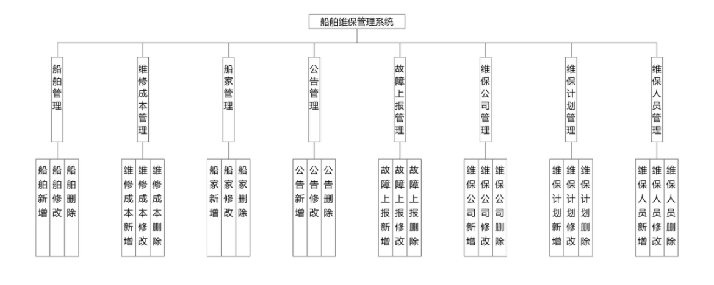
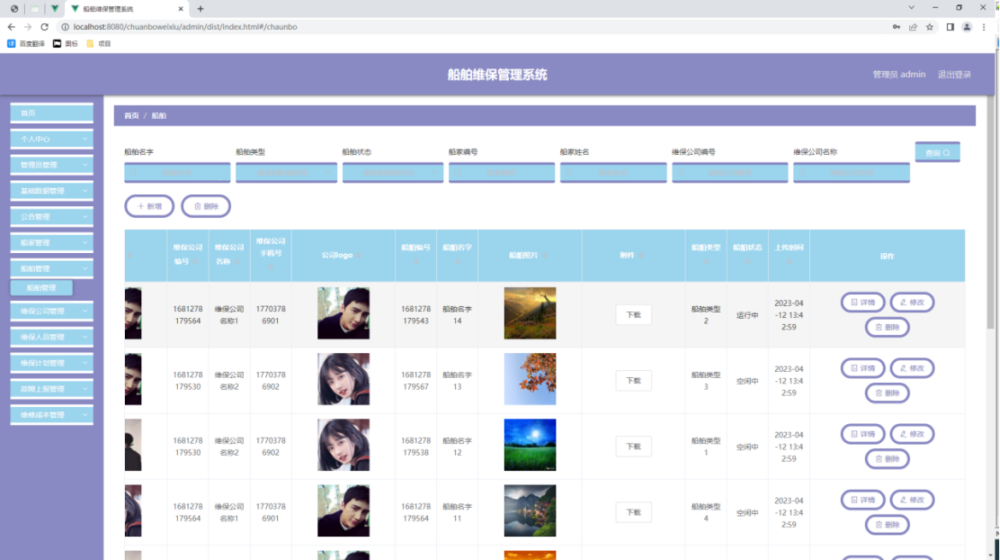
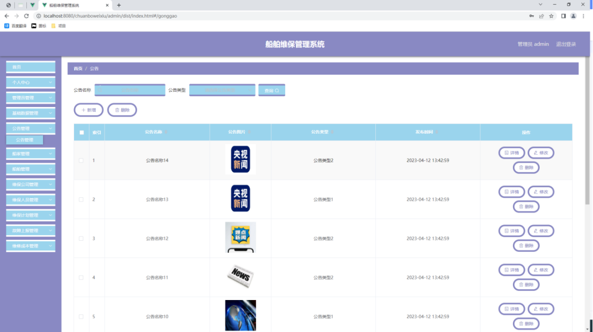
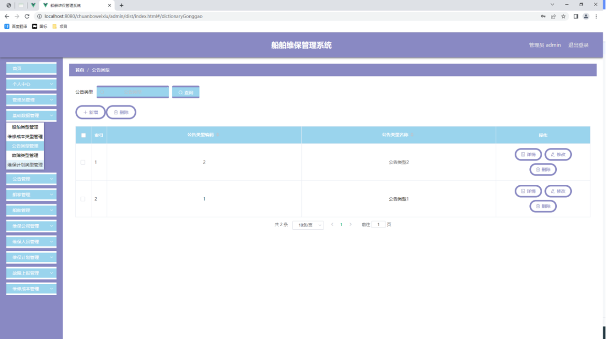
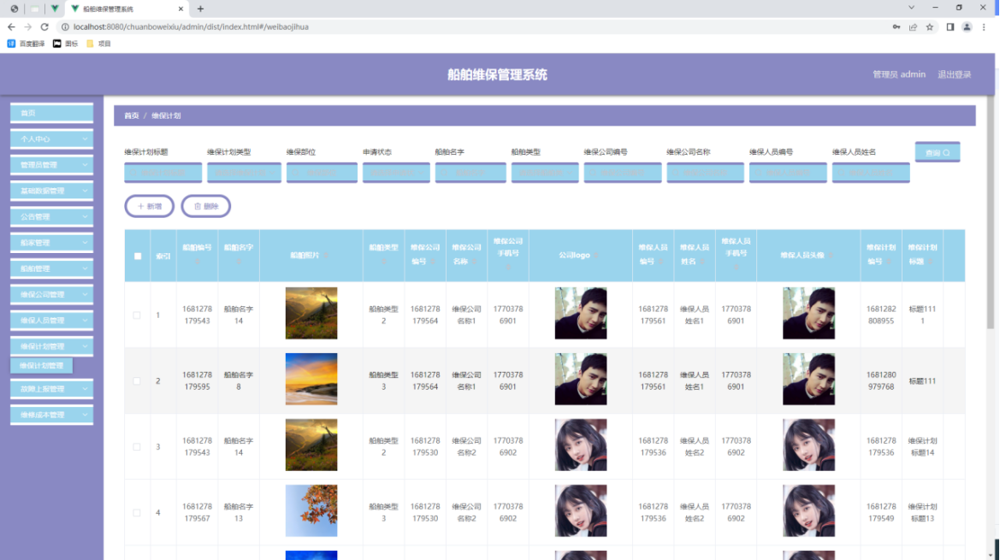
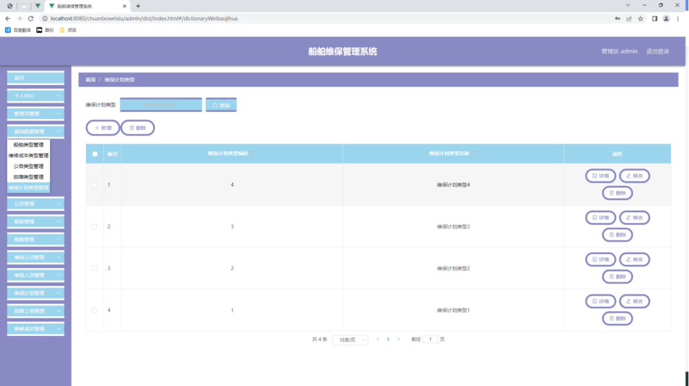
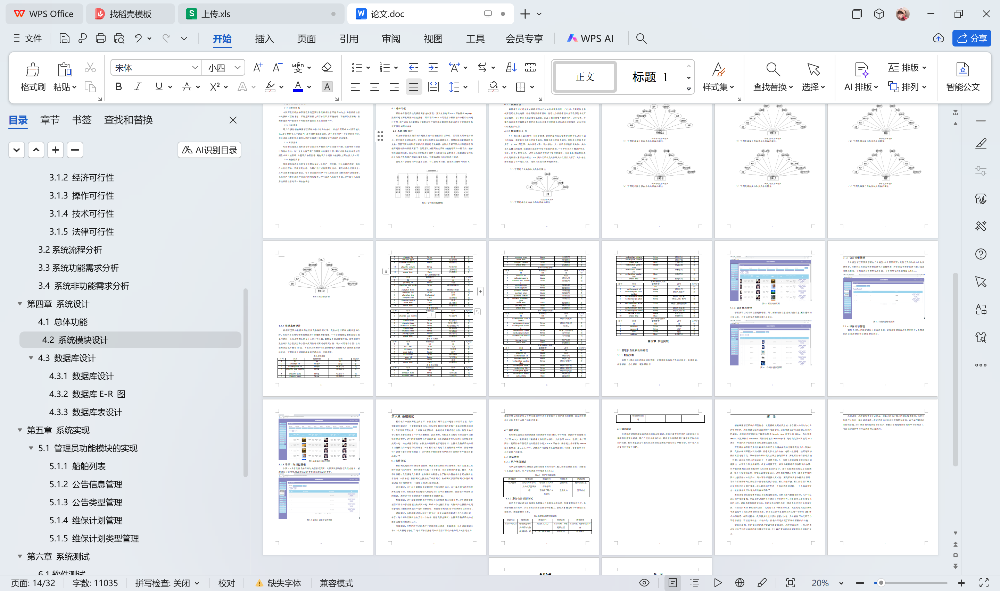

# springboot248-基于SpringBoot的船舶维保管理系统

>  博主介绍：
>  Hey，我是程序员Chaers，一个专注于计算机领域的程序员
>  十年大厂程序员全栈开发‍ 日常分享项目经验 解决技术难题与技术推荐 承接各类网站设计，小程序开发，毕设等。
>  【计算机专业课程设计，毕业设计项目，Java，微信小程序，安卓APP都可以做，不仅仅是计算机专业，其它专业都可以】

## 3000套系统可挑选，获取链接：https://chaerspol.github.io/

<b>QQ【获取完整源码】：674456564</b>

<b>QQ群【获取完整源码】：1058861570</b>

### 系统架构

> 前端：html | js | css | jquery | vue
>
> 后端：springboot | mybatis
> 
> 环境：jdk1.8+ | mysql | maven

# 一、内容包括
包括有  项目源码+项目论文+数据库源码+答辩ppt+远程调试成功

# 二、运行环境

> jdk版本：1.8 及以上； ide工具：IDEA； 数据库: mysql5.7及以上；编程语言: Java

# 三、需求分析

**3.1可行性分析**

可行性分析从时间，经济以及操作和技术上面进行调查和研究，确保合理利用信息资源，避免在进行程序设计过程中因为考虑不周到所带来的困扰，帮助我们更好的进行程序设计。

**3.1.1时间可行性**

本次进行系统开发，我预留了两个月时间来完成，从系统的需求分析，功能结构设计，功能详细设计以及系统测试等环节，两个月时间是可以完成程序开发操作的，我打算每天早中晚都进行程序的编写操作，这期间也包括查阅各种资料信息，加上同学以及老师的帮助和指点，相信程序开发的时间也会缩短不少。所以时间上是可行的。

**3.1.2 经济可行性**

船舶维保管理系统的开发平台是IDEA，数据库选用MySQL数据库，使用的浏览器都是大众浏览器，这些软件是不需要收费就能进行下载安装操作的。在系统开发的硬件选择上面，我使用的是自己的笔记本进行开发操作。因此在进行系统开发时，经济上面无需额外支出。开发出来的程序可以提高办公效率，带来的经济效益比较高，系统开发的投入产出比很可观。

**3.1.3 操作可行性**

船舶维保管理系统的界面设计比较简单，界面布局根据用户日常使用习惯进行设计，网站各个功能在导航栏里面清晰可见，网站的数据操作可视化，用户操作网站不需要培训就能上手，只需要跟着网站功能提示进行操作就行。

**3.1.4 技术可行性**

作为计算机专业学生，在学校期间就学习到许多关于编程方面的知识，像SSM技术，还有MySQL数据库等知识，我对IDEA开发平台以及MySQL数据库的操作也比较熟练，所以技术上面还是有一定把握。

**3.1.5 法律可行性**

自己本人开发的软件和用到的资料来源都是图书馆以及百度文库和百度网页等渠道，并不涉及违法。在个人毕业设计上面，无论源代码还是论文编写内容不存在抄袭行为。
从上面的经济，操作以及时间上面进行的分析，得出结论就是这次开发的船舶维保管理系统在开发上面是能够进行的，系统开发出来能创造更大的经济效益，越早开发升值空间越大。

**3.2系统流程分析**

船舶维保管理系统的开发也是有对应的流程，开发之前必须要进行用户功能需求的分析，最后根据功能需求进行网站设计还有数据库相关数据的设计工作，此次开发的船舶维保管理系统开发流程如图3.1所示。

# 四、功能模块

船舶维保管理系统系统在进行系统中功能模块的划分时，采用层次图来进行表示。层次图具有树形结构，它能使用矩形框来描绘数据信息。顶层代表的数据结构很完整，顶层下面的矩形框表示的数据就是子集数据，当然处于最下面的矩形框就是不能再进行细分的数据元素了，使用层次方框图描述系统功能能让用户一目了然，能够明白系统的功能，以及对应功能板块下面的子功能都可以清楚领会。船舶维保管理系统分为管理员和用户两部分操作角色，下面将对他们的功能进行阐述。管理员可以管理用户的基本信息，可以管理等功能。管理员功能结构图如下。

# 五、效果图展示【部分效果图】

图5.1 船舶列表页面【如图5.1显示的就是船舶列表页面，此页面提供给管理员的功能有：查看船舶、新增船舶、修改船舶、删除船舶等。】

图5.2 公告信息管理页面【管理员可以对公告信息进行管理，可以新增公告信息,修改公告信息,删除无效的公告信息。公告信息管理界面如图5.2所示。】

图5.3公告类型管理界面【公告类型管理页面显示所有公告类型，在此页面既可以让管理员添加新的公告信息类型，也能对已有的公告类型信息执行编辑更新，失效的公告类型信息也能让管理员快速删除。下图就是公告类型管理页面。公告类型管理界面如图5.3所示。】

图5.4维保计划管理页面【如图5.4显示的就是维保计划管理页面，此页面提供给管理员的功能有：新增维保计划,修改维保计划,删除维保计划。】

图5.5 维保计划类型管理页面【如图5.5显示的就是维保计划类型管理页面，此页面提供给管理员的功能有：新增维保计划类型,修改维保计划类型,删除维保计划类型。】

 <b>完整文章</b>
 
 
 

## 3000套系统可挑选，获取链接：https://chaerspol.github.io/

<b>QQ【获取完整源码】：674456564</b>

<b>QQ群【获取完整源码】：1058861570</b>

